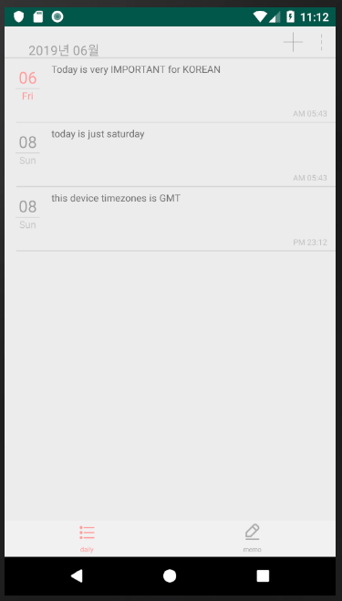
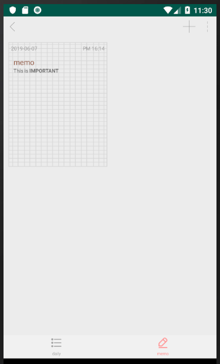

# Project: Diary_and_Memo
### used tool
 
-   **android: xml and java
-   **API: korean holiday api (https://www.data.go.kr/dataset/15012690/openapi.do)

### Project Overview

It is an Android app that can write notes and write diary.  
I used korean holiday api to change holidays into red.  
So, if you want to display holidays in red, you should get api key from [Open Data Portal](https://www.data.go.kr/main.do?lang=en).  
At last, the app are still remained some errors and TODOs.

# Program Imgae

### Diary

### Memo

